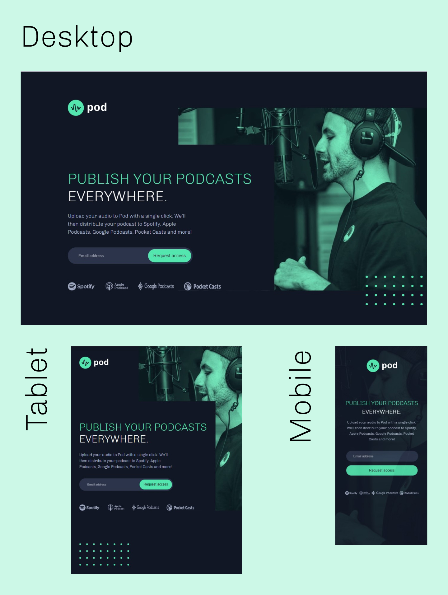

# Pod request access landing page solution

This is a solution to the [Pod request access landing page challenge on Frontend Mentor](https://www.frontendmentor.io/challenges/pod-request-access-landing-page-eyTmdkLSG).

## Table of contents

- [Overview](#overview)
  - [The challenge](#the-challenge)
  - [Screenshot](#screenshot)
  - [Links](#links)
- [My process](#my-process)
  - [Built with](#built-with)
  - [What I learned](#what-i-learned)
  - [Continued development](#continued-development)
  - [Useful resources](#useful-resources)
- [Author](#author)

## Overview

### The challenge

Users should be able to:

- View the optimal layout depending on their device's screen size
- See hover states for interactive elements
- Receive an error message when the form is submitted if:
  - The `Email address` field is empty should show "Oops! Please add your email"
  - The email is not formatted correctly should show "Oops! Please check your email"
- Receive a succsess message when the form is submitted if the email is formatted correctly

### Screenshot

### Links

- Solution URL: [Repository here](https://github.com/DHolets99/Landing-page-of-pod-request-access)
- Live Site URL: [Live site here](https://dholets99.github.io/Landing-page-of-pod-request-access/)

## My process

### Built with

- Semantic HTML5 markup
- CSS/CSS3
- Flexbox
- [jQuery](https://jquery.com/) - JS library

### What I learned

In this challenge I started to learn jQuery, and also improved my skills in adaptive layout.

## Author

- LinkedIn - [@Darya Holets](https://www.linkedin.com/in/dholets99/)
- Frontend Mentor - [@DHolets99](https://www.frontendmentor.io/profile/DHolets99)
- CodeWars - [@Darya H](https://www.codewars.com/users/Darya%20H)
